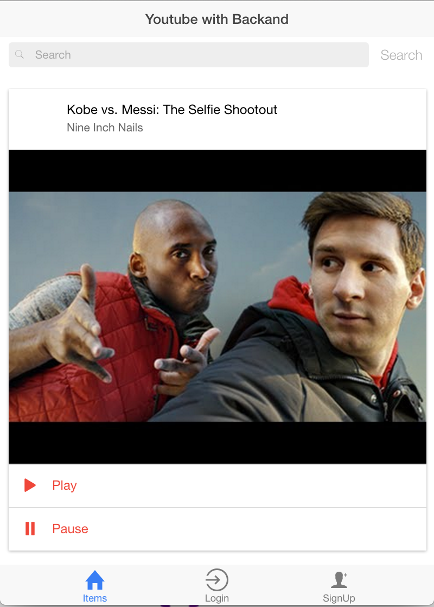
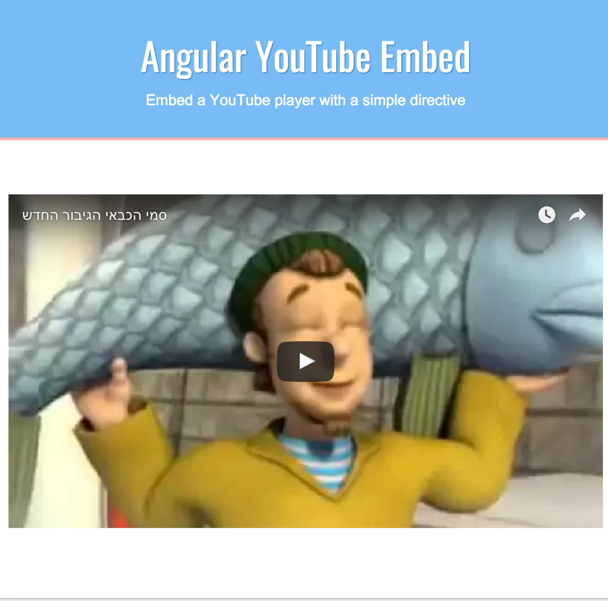

## Youtube Remote Controller Ionic example with Backand

Based on [Backand Ionic Social](https://github.com/backand/backand-ionic-social) example.

Project have two parts.

First part is mobile side, based on [Ionic](www.ionicframework.com).
It's a youtube search mobile application

To run this part you have to install first ionic cli, and on root folder run:

<code>
    ionic serve
</code>

If you want to customize application, you can see readme.md at [Backand Ionic Social](https://github.com/backand/backand-ionic-social) example. 

Second part is desktop side.
Is a fork of [youtube-angular](https://github.com/brandly/angular-youtube-embed) example.

To run this part on "client" folder run 

<code>
live-serve
</code>

After you run both parts, you should select a video in your mobile and be able to see it in your desktop.
You have a youtube remote client very simple and very powerful based on [Backand](https://www.backand.com)
Important notice: Don't open Backand.com and the application in same browser because we a have cookie issue, that will be solved in Backand sdk version 1.8.3
